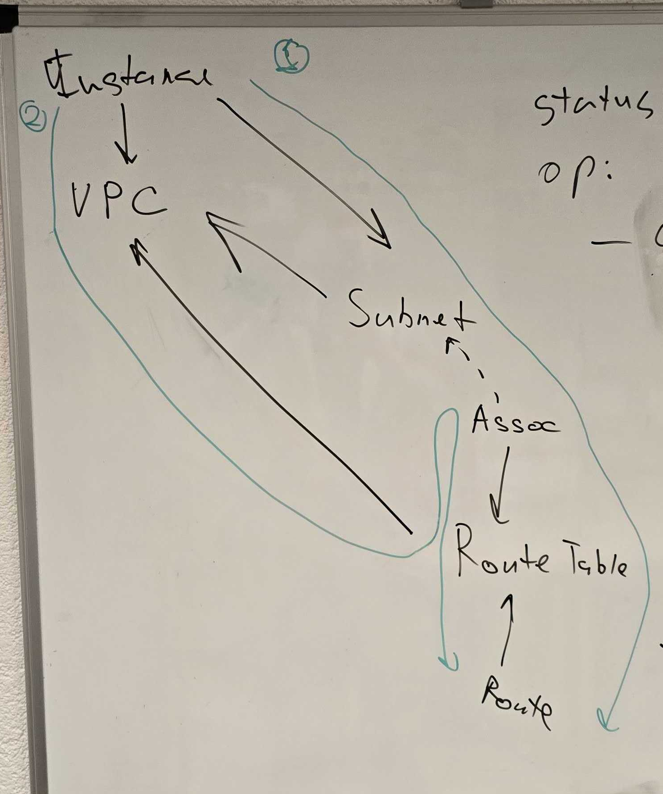

# Analysis

There are 2 paths we through the relationships we need to go through the check whether the instance is in violation:

1. We need to check whether there are any Route tables associated with the instance `instance -> subnet <- association`
   1. if there are associations, we go through  `instance -> subnet <- association -> route table <- route` and check the routes for violations
   2. if there are NO associations, it means that we need to check "Main" route table for VPC
      1. We go `instance -> vpc <- route table <- association` and look for the association where there is no "subnet id" and "main" checkbox is checked
      2. Then we go `instance -> vpc <- route table (THE MAIN ONE) <- routes` and check them for violating routes

# Path through object relationships

The full path from `CA10__CaAwsInstance__c` to `CA10__CaAwsRoute__c` looks like this:

* on `CA10__CaAwsInstance__c`
  * field `CA10__vpcSubnet__r` gets you to `CA10__CaAwsSubnet__c`
* on `CA10__CaAwsSubnet__c`
  * related list `CA10__routeTableAssociations__r` gives you array of `CA10__CaAwsRouteTableAssociation__c`
* on `CA10__CaAwsRouteTableAssociation__c`
  * field `CA10__routeTable__r` gets you to `CA10__CaAwsRouteTable__c`
* on `CA10__CaAwsRouteTable__c`
  * related list `CA10__routes__r` gives you array of `CA10__CaAwsRoute__c`
* you've arrived to `CA10__CaAwsRoute__c`
