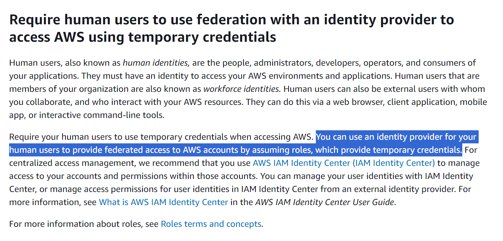

# Policy description

## Origin of the policy

This policy is based on CA policy ce:ca:aws:iam:account-has-no-users

There are a lot of similar policies, like <https://www.trendmicro.com/cloudoneconformity/knowledge-base/aws/IAM/iam-user-present.html>

# Does this policy make sense?

Seems like the original intent of the policy was force customers to use "IAM Users" instead of "root" user.

And obvious hypothesis was:
> If you don't have 0 IAM Users, you definitely have to use "root" user to do anything.

But then the second obvious question is:
> What about IAM Roles? Can you have 0 IAM Users and still perform every task in AWS with no issue?

And seems like it is not only possible, but also currently preferred way:

<https://docs.aws.amazon.com/IAM/latest/UserGuide/best-practices.html#bp-users-federation-idp>

Considering this, we can try to look for accounts without IAM Users and without IAM Roles at the same time, but realistically there will be none. Only completely idle accounts that were created and abandoned immediately.

Real-world example:
|Condition|# of Accounts|Explanation|
|---|---|---|
|CA10__users__r.has(COMPLIANT)|218 hits|Had at least 1 IAM User|
|CA10__roles__r.has(COMPLIANT)|90 hits|Did not have any IAM Users, but had at least 1 IAM Role|
|otherwise|1 hit|Did not have neither IAM User, nor IAM Roles, but was checked and it's a permission issue|

# Conclusion

> [!CAUTION]
> With the current approach it does NOT make sense to put this policy in production.

Can be reconsidered is new ideas arise.
