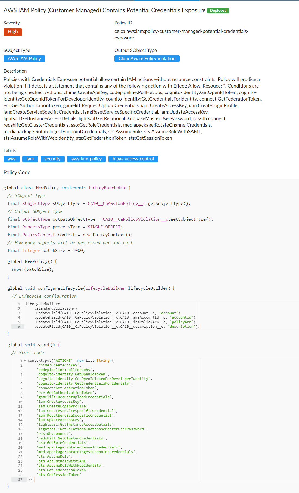
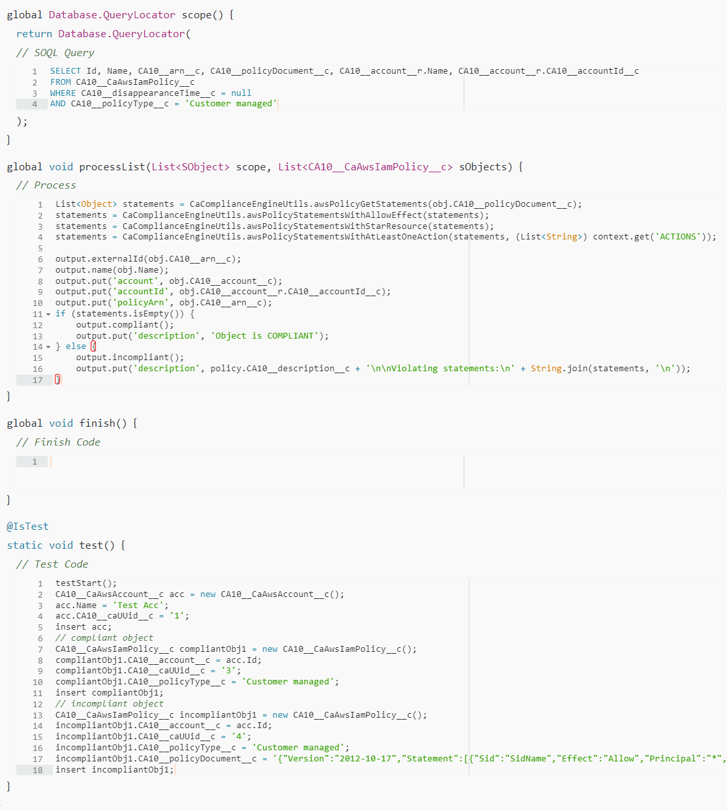

# Policy description

## Origin of the policy

The policy is based on CA policy `ce:ca:aws:iam:policy-customer-managed-potential-credentials-exposure`

The policy originates from a customer request and developed to their specifications.

# Does this policy make sense?

This policy basically looks for specific Actions in the policy statements. No other logic is applied.

Because the `inputObject` is `AWS IAM Policy`, the policy document is `Identity-based` and would not have any `Principal`.

We can not apply any specific `ACCESS_LEVEL` to filter out the statements, they all are going to be detected as `EXTERNAL_PRINCIPAL`,
but actually you can only attach this policy to the objects in your account, so effectively it's like `SAME_ACCOUNT`.

The only way of fixing the violation is to delete the actions from the policy.
But there would be use-cases where you have to have these actions to make things work.

> [!WARNING]
> So it's not completely clear if this policy is meaningless or we can modify it to make it somehow useful.

To be useful it has to have a path to make the object compliant without deleting the `Action` from the policy.
