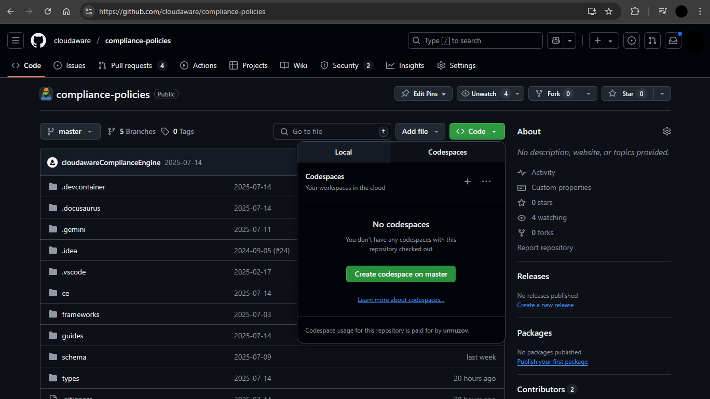

# Running Devcontainer

A [`devcontainer`](https://containers.dev/) is a running [Docker](https://www.docker.com/) container with a well-defined tool and runtime stack, and its workspace mounted into it. This setup allows you to run your development environment in a consistent and reproducible way.

This repository includes a pre-configured [`devcontainer.json`](../../../.devcontainer/devcontainer.json).

After your container is running, we recommend completing the [setup instructions](../../../.devcontainer/welcome.md) to authenticate all the necessary tools for the best developer experience.

There are several ways to run a devcontainer:

## GitHub Codespaces

[GitHub Codespaces](https://github.com/features/codespaces) is a service that provides cloud-based development environments. It is the easiest way to get started with devcontainers.

To explore the Compliance Engine development environment without committing any changes, you can create a GitHub Codespace directly from our [public repository](https://github.com/cloudaware/compliance-policies).

If you already have a [private repository](../../private-repository.md), you can create a GitHub Codespace from it to get a fully functional development environment.

## Local Devcontainers

We recommend using [Devpod](https://devpod.sh/) for running devcontainers locally.

Follow the [installation instructions](https://devpod.sh/docs/getting-started/install), and then create a workspace from your local repository or directly from a Git repository.

**Note for Windows users**: We do not recommend using [Docker Desktop for Windows](https://docs.docker.com/desktop/install/windows-install/) due to its poor disk I/O performance with workspaces located on the Windows filesystem. Instead, we recommend installing `docker` and the `devpod` CLI directly into WSL2 and using workspaces located within the WSL filesystem.
